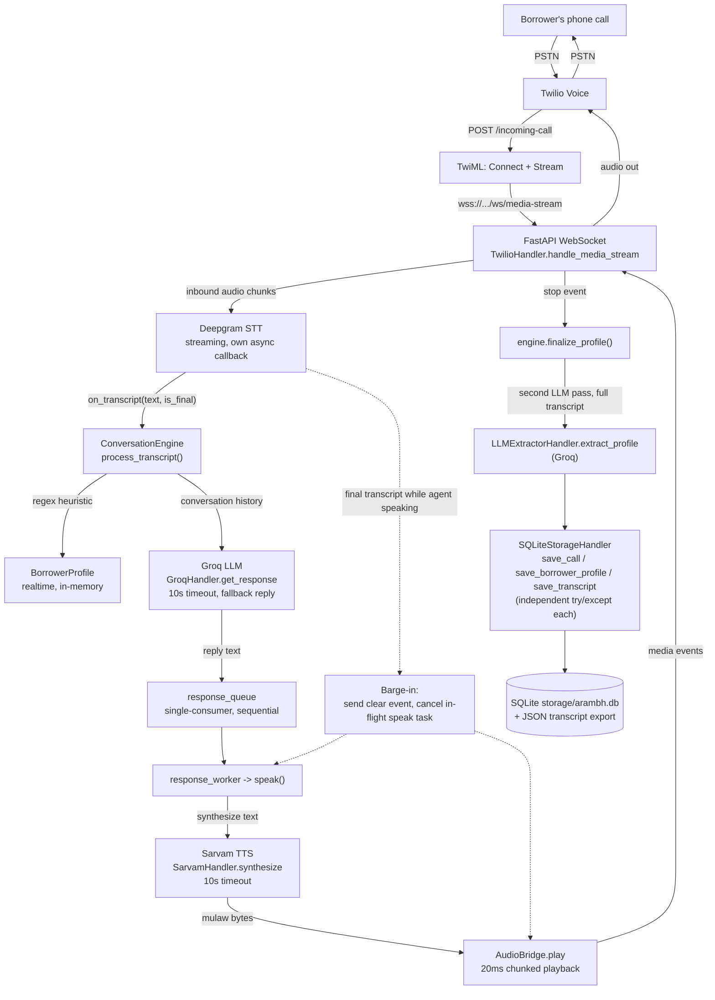

# Voice Engine

[](https://github.com/suhani-k7/arambh-voice-engine/actions/workflows/tests.yml)

Arambh Voice Engine is an AI voice agent that automates the initial borrower onboarding call for home loans and loans-against-property (LAP) lenders in India: it answers an inbound phone call over Twilio, holds a real-time spoken conversation (Deepgram for speech-to-text, a Groq-hosted LLM for dialogue, Sarvam AI for text-to-speech), extracts a structured borrower profile as it talks, and persists the profile and full transcript to SQLite — replacing a manual telephonic intake step with a self-serve one.

## Architecture

The real call path, as implemented today (`infrastructure/telephony/twilio_handler.py`, `application/conversation_engine.py`, `application/audio_bridge.py`):



A parallel, telephony-free path (`/dev/*` endpoints in `main.py`, driven by `tests/simulate_twilio.py`) exercises `ConversationEngine` directly for local development without a real phone call — it never touches STT/TTS/AudioBridge, which is why the latency numbers below are LLM-only.

## Key Features

Everything below is implemented and verified against the current codebase (nothing planned/aspirational):

- **Real-time telephony via Twilio Media Streams** — bidirectional audio over a WebSocket (`infrastructure/telephony/twilio_handler.py`), not request/response webhooks.
- **Streaming speech-to-text** with interim *and* final transcripts (Deepgram, `nova-2`, `en-IN`, 300ms endpointing).
- **LLM-driven conversational flow** (Groq-hosted LLM, defaults to `openai/gpt-oss-120b`, configurable via `LLM_MODEL`) with a stage-aware system prompt that tells the model what's already been collected and what's still missing.
- **Barge-in / interruption handling** — a final transcript arriving while the agent is mid-speech sends Twilio a `clear` event and cancels the in-flight TTS task (covers both synthesis and playback, and the greeting itself), instead of waiting for the agent to finish talking.
- **Conversation state machine** (`ConversationStage` enum) with fast, stage-gated regex extraction for realtime field capture (name, phone, loan amount, income, purpose).
- **Two-pass structured data extraction** — cheap regex heuristics during the call for low-latency stage transitions, then a second, more careful LLM extraction pass over the full transcript at call end to reconcile/upgrade the realtime guesses.
- **Timeout + fallback recovery** — both the LLM reply and the TTS synthesis call are wrapped in a 10s timeout; a stuck LLM call falls back to a "could you repeat that" reply instead of hanging the turn, and a stuck TTS call is skipped (logged, not fatal) instead of stalling the whole call's finalization.
- **Per-stage latency instrumentation** (`utils/latency.py`) — timing hooks around STT finalization, LLM response, and TTS synthesis, logged with `call_sid` and readable back via `GET /dev/last-call-metrics`.
- **Repository-style SQLite persistence** behind a `StorageHandler` interface, with each of the three saves (call metadata, borrower profile, transcript) independently error-handled so one failure doesn't silently drop the others, plus a parallel JSON transcript export per call.
- **Clean / ports-and-adapters architecture** — `core/interfaces.py` defines abstract ports (`TelephonyHandler`, `STTHandler`, `LLMHandler`, `TTSHandler`, `StorageHandler`, `ExtractorHandler`); every concrete provider lives behind a factory in `factories/`, so swapping Deepgram/Groq/Sarvam for another provider touches one file.
- **REST API for stored data** — `GET /borrowers`, `GET /borrowers/{call_sid}`, `GET /calls/{call_sid}/transcript`.
- **Automated test suite + CI** — pytest/pytest-asyncio tests covering the full pipeline, deterministic mocked conversation scenarios, barge-in, and failure-injection/timeout behavior, run automatically on every push/PR via GitHub Actions.

## Tech Stack

| Layer | Technology |
|---|---|
| **Backend / Web** | Python 3.14, FastAPI, Uvicorn, WebSockets, httpx, python-dotenv |
| **Telephony** | Twilio Voice + Media Streams (TwiML `<Connect><Stream>`) |
| **Speech-to-Text** | Deepgram (streaming, `deepgram-sdk`) |
| **LLM** | Groq-hosted LLM, default `openai/gpt-oss-120b` (OpenAI-compatible chat completions API via the `groq` SDK) — used for both conversational replies and structured extraction |
| **Text-to-Speech** | Sarvam AI (`bulbul:v1`, `meera` voice), WAV→mulaw conversion via `audioop`/`audioop-lts` |
| **Storage** | SQLite (WAL mode) + per-call JSON transcript export |
| **Testing** | pytest, pytest-asyncio |
| **CI** | GitHub Actions |

See `requirements.txt` / `requirements-dev.txt` for exact pinned versions.

## Measured Performance

Real numbers from `tests/simulate_twilio.py`'s latency profiler (option 6), run against the live dev server with real Groq credentials — 15 simulated calls, 5 turns each:

| Stage | Samples | p50 | p95 | min | max |
|---|---|---|---|---|---|
| LLM response (`GroqHandler.get_response`) | 72 | 2539.8 ms | 5248.9 ms | 465.8 ms | 5856.9 ms |

**Scope of this measurement:** the profiler drives `ConversationEngine` through the `/dev/*` endpoints, which never touch STT or TTS — so this is the LLM round-trip only, not full voice-to-voice latency. Measuring `stt_final_to_tts_start` and `tts_synthesis` (both already instrumented, see `utils/latency.py`) requires a real Twilio call through `/ws/media-stream`, which needs a live phone call or a properly wired Twilio Media Streams simulation; that wasn't run for this table.

**Known limitation:** a p50 of 2.5s and p95 of 5.2s for the LLM turn alone is on the higher end for real-time voice UX — noticeable dead air on a phone call even before STT/TTS latency is added on top. This is a known bottleneck and a target for future optimization, not a tuned/final number. Directions worth exploring:

- **Stream the LLM response** instead of waiting for the full completion before starting TTS, so synthesis (and eventually playback) can begin on the first tokens rather than after the whole reply is generated.
- **Try a smaller/faster Groq-hosted model** than the current default (`openai/gpt-oss-120b`), trading some response quality for latency.
- **Reduce prompt size** — the stage/missing-fields context hint and conversation history sent on every turn add tokens to both the prompt and the round-trip.

Reproduce or extend these numbers with:

```bash
python tests/simulate_twilio.py   # choose option 6, then a call count
```

## Setup

```bash
git clone <this-repo-url>
cd arambh-voice-engine

python3 -m venv venv
source venv/bin/activate        # Windows: venv\Scripts\activate

pip install -r requirements.txt
pip install -r requirements-dev.txt   # only needed to run the test suite
```

Create a `.env` file in the project root (gitignored; there is no `.env.example` in the repo, so create it from scratch):

```bash
DEEPGRAM_API_KEY=your_deepgram_key
SARVAM_API_KEY=your_sarvam_key
LLM_API_KEY=your_groq_key

# Optional — shown values are the defaults in config/settings.py
LLM_MODEL=openai/gpt-oss-120b
LLM_INFRA_ENDPOINT=https://api.groq.com/openai/v1/chat/completions
HOST=0.0.0.0
PORT=8000

# Only needed for real inbound calls
TWILIO_ACCOUNT_SID=your_twilio_sid
TWILIO_AUTH_TOKEN=your_twilio_auth_token
TWILIO_PHONE_NUMBER=your_twilio_number
```

`DEEPGRAM_API_KEY`, `SARVAM_API_KEY`, and `LLM_API_KEY` are required — the app raises at startup if any are missing.

Run the server:

```bash
python main.py
# or: uvicorn main:app --reload --host 0.0.0.0 --port 8000
```

`GET http://localhost:8000/health` should return `{"status": "ok", ...}`.

For a real inbound call, `/incoming-call` needs to be reachable from Twilio (e.g. an ngrok tunnel pointed at your local server) — the public callback domain is currently read from the request's `Host` header, which only works safely behind a trusted single-purpose tunnel like ngrok in dev; pinning it to a configured value instead is planned Phase 7 work.

For local development without a real phone call, use the interactive menu:

```bash
python tests/simulate_twilio.py
```

## Testing

The test suite (`tests/`, pytest + pytest-asyncio) covers:

- `test_e2e_call_flow.py` — one real end-to-end call through `/dev/*` against a live server with real Groq credentials (the one true "does the whole pipeline work" smoke test).
- `test_conversation_scenarios.py` — deterministic, mocked multi-turn scenarios (complete info, partial/missing fields, off-script-then-recovers) testing `ConversationEngine`'s own stage-progression and extraction logic.
- `test_barge_in.py` — verifies a final transcript arriving mid-speech cancels the in-flight TTS task and clears Twilio's buffer.
- `test_failure_injection.py` — forces the LLM/TTS/STT/storage adapters to raise or hang and asserts the current timeout/fallback/error-isolation behavior.
- `test_phase5_direct.py` — direct storage + extractor checks (the extractor test needs real Groq credentials; excluded from CI, see below).

Run everything (needs a running `python main.py` with real API keys for full coverage; without one, `test_e2e_call_flow.py` self-skips):

```bash
pytest tests/ -v
```

**CI:** `.github/workflows/tests.yml` runs the suite on every push and pull request to `main` (the badge at the top of this file reflects its status). CI uses dummy, non-secret placeholder API keys — just enough to satisfy startup validation — since every test that runs there either mocks the provider call or self-skips without a live server; `test_e2e_call_flow.py` and `test_phase5_direct.py::test_extractor_direct` are the two that need real credentials and don't run in CI.

## Roadmap

| Phase | Scope | Status |
|---|---|---|
| 0 – Project Setup | Repository initialized, core clean-architecture skeleton created, basic FastAPI app scaffolded | ✅ Completed |
| 1 – Telephony Integration | Twilio/WebSocket audio streaming, `TelephonyHandler` interface and `twilio_handler` implementation | ✅ Completed |
| 2 – Speech-to-Text | Deepgram streaming STT handler, `STTHandler` interface, basic transcript collection | ✅ Completed |
| 3 – Conversational Logic | `ConversationEngine`, `ConversationState`, LLM response handling, basic turn-taking flow | ✅ Completed |
| 4 – Text-to-Speech | Sarvam AI TTS handler, audio synthesis back to Twilio | ✅ Completed |
| 5 – Data Extraction & Persistence | LLM-based borrower profile extraction (`ExtractorHandler`), SQLite storage (`SQLiteStorageHandler`), API endpoints for retrieving borrower profiles and transcripts | ✅ Completed |
| 6 – E2E Testing & Hardening | End-to-end test suite, latency profiling, timeout/fallback recovery, transcript fallbacks | ✅ Completed |
| 7 – Deployment | Backend deployment pipeline, webhook signature verification, pinned callback domain config, CI/CD integration | 🔜 Planned |
| 8 – Analytics | Call metrics collection, latency monitoring, success/failure rates, conversation analytics dashboard | 🔜 Planned |
| 9 – Documentation | Full developer docs, usage guides, README expansion, API reference | 🔜 Planned |
